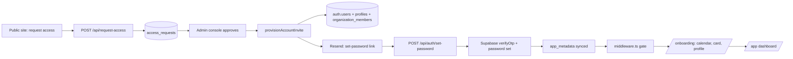
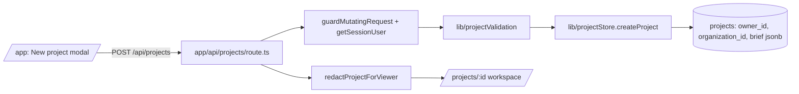
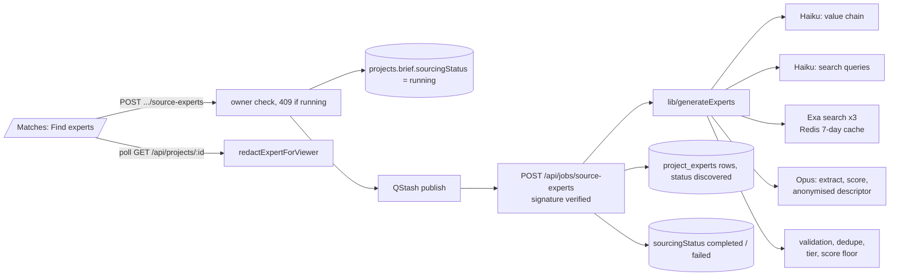
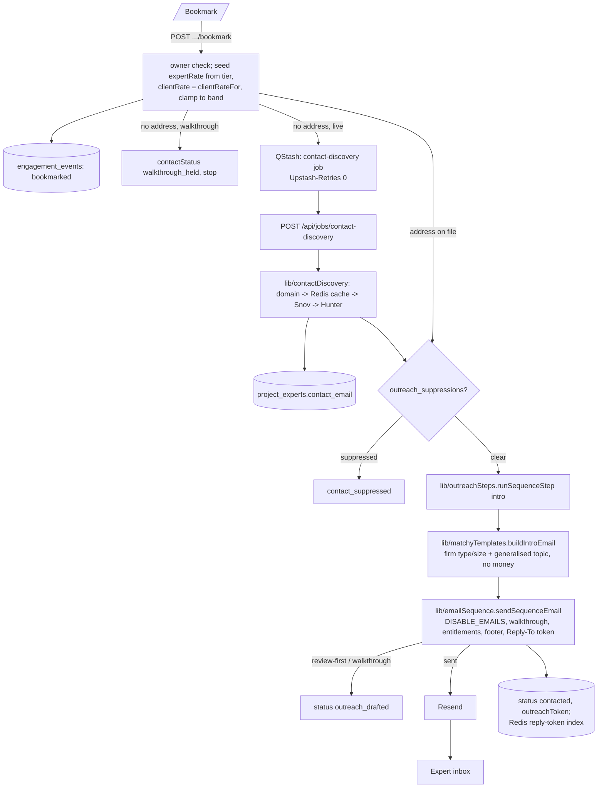
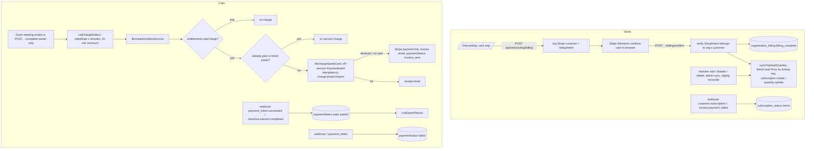

# ExpertMatch: Technical Architecture

*Written 2026-09-08 against branch `docs/architecture-map` (a snapshot of `main` at 0d1dd1b plus the then-uncommitted identity-boundary / entitlements / product-events work). Companion documents: `ARCHITECTURE-PLAIN.md` (non-technical) and `ARCHITECTURE-AUDIT.md` (findings). Product rules live in `CLAUDE.md` and `docs/MATCHY_SPEC.md`; operational history in `HANDOFF.md`.*

## Contents

1. System overview
2. Technology stack
3. Repository tree
4. Core data model
5. Authentication and authorization
6. Critical workflows (with diagrams)
7. External integrations
8. Environment variables
9. Testing architecture
10. Deployment architecture

## 1. System overview

ExpertMatch is a self-serve expert network for private-equity, consulting, law and corporate-strategy teams. A client writes a short research brief; the platform finds and scores candidate experts from the public web; the client bookmarks the ones worth a call; an automated relay called **Matchy** then finds the expert's email, sends an anonymised introduction, asks about conflicts and rate, relays every message through a compliance screen, proposes and books a Zoom call, and hands off to billing. The client is charged on their saved card when the call completes and the expert is paid through Stripe Connect.

There are three kinds of people in the system. **Clients** belong to an organization (a firm), sign in with email and password, and see only their own organization's projects; within an organization one person is the **champion** (`org_role = 'org_admin'`) who sees the firm's billing. **Platform admins** (`role = 'admin'` in Supabase `app_metadata`) run the admin console, approve access requests, and see unredacted data. **Experts** never have an account: every expert interaction happens over ordinary email plus a few signed-token links (a time picker, a Stripe Connect onboarding page, an opt-out link).

The application is a single Next.js 14 App Router codebase deployed on Vercel. Pages under `app/` are React client components that call JSON API routes under `app/api/`; the routes call a library layer under `lib/` that owns all data access and integrations. Supabase provides authentication and the Postgres database. Since the identity-boundary migration (2026-09-08) every project-family table is service-role only: the application reads and writes through a service-role client, and access control is enforced in `lib/projectStore.ts` (who may see a project) and `lib/redactExpert.ts` (what a viewer may see about an expert), not by row-level security.

Slow work runs out of band. Sourcing, contact discovery and follow-up nudges are published to Upstash QStash, which calls back signed worker routes under `app/api/jobs/`. Two Vercel cron entries plan the day's nudges and run a nightly reconcile sweep. Three inbound webhooks (Stripe, Zoom, Resend inbound email) drive state changes from outside. Upstash Redis holds rate limits, caches and a few short-lived tokens, and every use of it fails open.

Two invariants shape most of the code. **Blinding:** the client never sees an expert's name, employer, LinkedIn or email before a call is booked, and the expert never sees the client's name, firm, project name or the client-side rate. **Two numbers:** every engagement carries an `expertRate` (what the expert is offered and paid, staff- and expert-facing only) and a `clientRate` (what the client pays, derived by `lib/pricing.ts` at a 50% take and rounded up to the next $50). These two numbers never appear in the same message, and only `lib/pricing.ts` converts between them.

A project starts in **walkthrough mode**: the client can click through the entire flow and see exactly what Matchy would say, but no email reaches an expert and no paid provider is called. Going live is a two-step confirmation that lands the project on "review before sending". The send chokepoint (`lib/emailSequence.sendSequenceEmail`) re-checks walkthrough, the global do-not-contact list, the `DISABLE_EMAILS` kill switch and the organization's entitlements on every send, so a bug upstream cannot email an expert by accident.

Money moves in three places: a per-seat monthly subscription per organization (Stripe Billing, volume-tiered price created lazily by lookup key), an off-session charge of the client's saved card when a call completes (with a payment-link fallback), and a Stripe Connect transfer to the expert once the client's payment succeeds. Stripe is currently in **test mode**.

The lifecycle of a client account: access request on the public site → platform admin approves (creating or joining an organization) → invite email with a signed set-password link → onboarding (calendar connection, saved card, profile) gated by middleware → dashboard. The lifecycle of an engagement: `discovered` → `bookmarked` → `contacted` → `replied`/`followup_sent` → `rate_negotiation` → `scheduling_sent` → `scheduled` (identities reveal both ways) → `completed` (charge + payout), or `rejected`/`rejected_after_outreach` at any point.

## 2. Technology stack (as found in `package.json` and the code)

| Layer | Technology | Notes |
| --- | --- | --- |
| Framework | Next.js 14.2 (App Router), React 18, TypeScript 5 strict | Not Next 15/16; `middleware.ts` at the edge, routes on Node |
| Styling | Tailwind CSS 3.4, `next/font/google` (Spectral, Libre Franklin) | Palette duplicated in `tailwind.config.js` and `app/globals.css` |
| Hosting | Vercel project `expertmatching` → `expertmatch.fit` | Deploy by pushing `main`; two Vercel Cron entries in `vercel.json` |
| Database + auth | Supabase (Postgres with RLS, Supabase Auth) via `@supabase/ssr` and `@supabase/supabase-js` | Migrations pasted into Studio; service-role client for all app data access |
| Queue | Upstash QStash (`@upstash/qstash` receiver; publish via REST) | Region-pinned us-east-1; workers verify signatures |
| Cache / rate limits | Upstash Redis (REST) | Fail-open everywhere |
| Email out | Resend (`resend`) | From-address forced onto the verified domain by `lib/mailFrom.ts` |
| Email in | Resend inbound webhook, verified with `svix` | Reply-To carries a signed per-thread token |
| Payments | Stripe (`stripe`, `@stripe/stripe-js`) incl. Billing (seats) and Connect (payouts) | Test mode; single pinned API version in `lib/stripe.ts` |
| Video | Zoom Server-to-Server OAuth (create/update/delete meeting) + Zoom webhook | Meeting end triggers billing |
| Calendars | Google Calendar OAuth (free/busy) for clients and experts; Calendly URL; manual windows | OAuth tokens AES-256-GCM encrypted at rest |
| LLMs | Anthropic (`@anthropic-ai/sdk`: claude-haiku-4-5 ×2 and claude-opus-4-6 ×1 per sourcing run, plus Haiku for descriptors and brief parsing); OpenAI (`openai`: gpt-4o-mini for reply classification, scheduling-reply parsing, interview guide, optional nudge variation) | `ai` and `@ai-sdk/anthropic` are installed but imported nowhere |
| Web search | Exa (`exa-js`) in production; Tavily and ScrapingBee providers exist as alternatives | No search key is boot-validated |
| Email finding | Snov.io, Hunter.io | Optional; gated by `CONTACT_ENRICHMENT_ENABLED` |
| PDF | `@react-pdf/renderer` (brief export) | |
| Other | `axios` (Zoom calls only); `nodemailer` and `bcryptjs` are installed but imported nowhere | |
| Testing | No runner. `scripts/test-*.ts` executed with `npx tsx`; `scripts/rls/` psql harness; `scripts/e2e-matchy.ts` against a live URL | |
| CI | Two GitHub Actions running Claude Code (PR review, `@claude` mentions); no build/test workflow | |

## 3. Repository tree

One sentence per first-party file. Generated files (`lib/supabase/database.types.ts` is hand-authored but treated as generated), `node_modules`, `.next`, lockfiles and static assets are omitted.

```text
├── .github/workflows/
│   ├── claude-code-review.yml  : CI: automatic PR review via the claude-code-action.
│   └── claude.yml  : CI: runs the Claude assistant action when a PR/issue mentions @claude.
├── app/
│   ├── admin/requests/page.tsx  : Platform-admin console: access/seat requests, orgs/billing, members, trial creation, needs-attention, env status.
│   ├── api/
│   │   ├── admin/
│   │   │   ├── attention/route.ts  : GET the merged needs-attention feed (system failures, stuck sourcing, past-due orgs).
│   │   │   ├── env-status/route.ts  : GET presence-only booleans for every required/optional env var, grouped by system.
│   │   │   ├── firms/route.ts  : GET/POST/DELETE organizations: list with seat usage/billing, create/update/seat-cap, sync-seats, delete-with-Stripe-cancel.
│   │   │   ├── requests/route.ts  : GET/POST access requests: list pending, approve (provision account + optional trial) or reject.
│   │   │   ├── seat-requests/route.ts  : GET/POST existing-org seat requests: list, approve (re-run provisioning, re-check seat cap) or reject.
│   │   │   └── users/route.ts  : GET/POST/PATCH/DELETE platform-wide user management: list, invite, enable/disable, permanent delete.
│   │   ├── auth/
│   │   │   ├── login/route.ts  : POST login: Supabase password sign-in, enumeration-safe, fail-open per-IP throttle.
│   │   │   ├── logout/route.ts  : POST logout; three-step session-cookie clearing.
│   │   │   ├── me/route.ts  : GET the caller's own identity, onboarding, and entitlement state.
│   │   │   ├── reset/route.ts  : Public mount for the password reset-request flow.
│   │   │   └── set-password/route.ts  : Redeems an invite/reset link, sets the password, activates the account.
│   │   ├── availability/
│   │   │   ├── [token]/google-auth/route.ts  : Expert-side Google OAuth initiate; picker token rides inside the signed state.
│   │   │   └── oauth/google/callback/route.ts  : Expert-side OAuth callback: state HMAC + nonce, code exchange, encrypt, persist to the expert.
│   │   ├── email-sequence/trigger/route.ts  : (DEAD: drains only pre-Matchy queued jobs) QStash-signed drain; whole route is dead once the queue empties.
│   │   ├── expert-onboarding/[token]/route.ts  : Token-gated, rate-limited Stripe Connect account create plus hosted onboarding redirect.
│   │   ├── inbound-email/route.ts  : Resend inbound webhook; Matchy's whole read-reply pipeline.
│   │   ├── jobs/
│   │   │   ├── contact-discovery/route.ts  : QStash-signed worker that runs one contact-discovery job; documents signature verification and no-retry contract.
│   │   │   ├── reconcile/route.ts  : Nightly Vercel cron (06:00 UTC): reconciles org seat quantities, pending payouts, stuck sourcing runs.
│   │   │   ├── schedule-nudges/route.ts  : Daily Vercel cron (05:00 UTC) that scans waiting engagements and enqueues one nudge job per engagement.
│   │   │   ├── send-nudge/route.ts  : QStash-signed worker; the only code path that actually sends a follow-up nudge email.
│   │   │   └── source-experts/route.ts  : QStash worker that runs generateExperts; the only job route with no maxDuration.
│   │   ├── onboarding/
│   │   │   ├── billing/
│   │   │   │   ├── confirm/route.ts  : Verifies the SetupIntent belongs to the org's customer, marks billing complete, starts seat subscription.
│   │   │   │   └── route.ts  : Mints the org SetupIntent (or reports already-complete/trial); org_admin gate on replace/activate.
│   │   │   ├── calendar/
│   │   │   │   ├── google/
│   │   │   │   │   ├── callback/route.ts  : Client-side OAuth callback; state email must equal the live session.
│   │   │   │   │   └── route.ts  : Client-side Google OAuth initiate (freebusy + openid + email scopes).
│   │   │   │   ├── status/route.ts  : GET the caller's own calendar connection state, for the stepper and settings editor.
│   │   │   │   └── route.ts  : POST Calendly or manual (weekly windows + one-off dates) calendar setup.
│   │   │   └── profile/route.ts  : Final onboarding step / later profile edit; server re-checks billing and calendar.
│   │   ├── org/
│   │   │   ├── members/route.ts  : GET/POST/PATCH/DELETE team management for org admins.
│   │   │   └── membership/route.ts  : GET the caller's own org membership; self-heals metadata sync.
│   │   ├── outreach/unsubscribe/route.ts  : Public GET opt-out from the CAN-SPAM footer link; vulnerable to GET-prefetch opt-outs.
│   │   ├── parse-brief/route.ts  : Extracts structured brief fields from an uploaded PDF/text document with Claude.
│   │   ├── projects/
│   │   │   ├── [projectId]/
│   │   │   │   ├── collaborators/route.ts  : Add/remove read-only project collaborators, same-organization only.
│   │   │   │   ├── experts/
│   │   │   │   │   ├── [expertId]/
│   │   │   │   │   │   ├── booking/ics/route.ts  : The client's on-demand .ics calendar download for a booked call.
│   │   │   │   │   │   ├── bookmark/route.ts  : Starts the engagement: seeds rates, emits events, then discovers contact or sends Matchy's intro.
│   │   │   │   │   │   ├── complete/route.ts  : Owner-only "mark call complete and bill it"; server recomputes the amount.
│   │   │   │   │   │   ├── messages/
│   │   │   │   │   │   │   ├── [messageId]/send/route.ts  : Approve-and-send one review-first draft message.
│   │   │   │   │   │   │   └── route.ts  : GET redacted thread per viewer; POST client reply (screened, sent, stored).
│   │   │   │   │   │   ├── outreach/approve/route.ts  : Approve-and-send the review-first intro message.
│   │   │   │   │   │   ├── propose-times/route.ts  : Owner-only "find a time" trigger, with preference screening.
│   │   │   │   │   │   ├── rate-decision/route.ts  : Accept/counter a rate; enforces the rate band and the two-numbers rule.
│   │   │   │   │   │   ├── unbookmark/route.ts  : Undoes a bookmark, only while nothing has left the building.
│   │   │   │   │   │   └── route.ts  : Update or remove one expert on a project; holds collaborator/owner field allow-lists.
│   │   │   │   │   └── route.ts  : Add sourced candidates to a project; prefers the server's stored candidate over the client's copy.
│   │   │   │   ├── interview-guide/route.ts  : Generates the client's call guide from only what that viewer may see, and re-redacts the answer.
│   │   │   │   ├── source-experts/route.ts  : Client-facing "start sourcing" endpoint: auth, owner check, 409 guard, mark running, enqueue job.
│   │   │   │   └── route.ts  : Load/save/delete one project, incl. Matchy settings, go-live gate, and brief-version conflict check.
│   │   │   └── route.ts  : GET list caller's projects; POST create a project (owner/org from session, walkthrough by default).
│   │   ├── request-access/route.ts  : Public access-request intake; emails hardcoded admin recipients.
│   │   ├── schedule/[token]/route.ts  : Expert picker API: token resolution/revocation, pick (book/rebook) and unavailable (re-propose or give up).
│   │   ├── settings/payment-method/route.ts  : Champion-only read of the firm's saved card (brand/last4/expiry/addedBy).
│   │   └── webhooks/
│   │       ├── stripe/route.ts  : Signature-verified Stripe webhook: payment success/failure, subscription mirror, Connect account.updated retry.
│   │       └── zoom/route.ts  : Zoom v2-signed webhook: meeting.started flag, meeting.ended triggers duration/completion/invoice.
│   ├── app/page.tsx  : Client project dashboard: project list, stage pills, new-project modal.
│   ├── auth/
│   │   ├── reset/
│   │   │   ├── page.tsx  : The /auth/reset page shell.
│   │   │   └── ResetRequestForm.tsx  : Password reset-request form component.
│   │   └── set-password/
│   │       ├── page.tsx  : Server component that pre-validates the HMAC invite/reset token.
│   │       └── SetPasswordForm.tsx  : Password-setting form used by both invite and reset flows.
│   ├── contact/page.tsx  : Contact page.
│   ├── expert-onboarding/
│   │   ├── [token]/page.tsx  : Thin forwarder page into the expert-onboarding API route.
│   │   ├── refresh/page.tsx  : "Link expired" page for expired Stripe Connect onboarding links.
│   │   └── return/page.tsx  : "Payout account set up" confirmation page.
│   ├── login/
│   │   ├── layout.tsx  : Segment layout supplying login page metadata.
│   │   └── page.tsx  : Sign-in form page.
│   ├── onboarding/page.tsx  : Three-step onboarding stepper (profile/calendar/billing), server-verified on every mount.
│   ├── outreach/unsubscribed/page.tsx  : Static landing page shown after a CAN-SPAM opt-out redirect.
│   ├── payment/success/page.tsx  : Public post-payment-link landing page.
│   ├── pricing/page.tsx  : Pricing page; renders seat tiers from lib/pricing.ts.
│   ├── privacy/page.tsx  : Privacy policy page; carries founder-decision placeholder tokens.
│   ├── projects/[projectId]/page.tsx  : The project workspace: Brief/Matches/Conversations tabs, sourcing, interview guide, share/delete modals.
│   ├── request-access/
│   │   ├── page.tsx  : Marketing shell page hosting the public access-request form.
│   │   └── RequestAccessForm.tsx  : Public access-request form component.
│   ├── schedule/
│   │   ├── [token]/page.tsx  : Thin public server shell that verifies the picker token and renders SchedulePicker.
│   │   └── connected/page.tsx  : Standing OAuth-success outcome page for the expert calendar-connect flow.
│   ├── settings/
│   │   ├── team/page.tsx  : Org-admin seat and member management page.
│   │   └── page.tsx  : Firm settings shell/hub page.
│   ├── signup/[token]/page.tsx  : (RETIRED: legacy invite-link redirect) can no longer produce a redeemable link.
│   ├── terms/page.tsx  : Terms of service page; carries a legal-entity-name confirmation placeholder.
│   ├── globals.css  : Global stylesheet (Tailwind directives + custom CSS); duplicates color tokens with tailwind.config.js.
│   ├── layout.tsx  : App Router root layout: loads fonts and sets site metadata/OG tags.
│   └── page.tsx  : Marketing landing page.
├── components/
│   ├── onboarding/
│   │   ├── BillingStep.tsx  : Imperative Stripe Elements card capture and confirm, with a retry that skips re-confirming.
│   │   ├── CalendarStep.tsx  : Shared three-provider calendar editor, used in both onboarding and settings modes.
│   │   ├── ProfileStep.tsx  : Name/title profile form; handles the server's 409 prerequisite bounce.
│   │   └── shared.ts  : Shared palette/class constants for the onboarding stepper.
│   ├── settings/
│   │   ├── CalendarPanel.tsx  : /settings wrapper that loads calendar status and reuses CalendarStep.
│   │   ├── PaymentPanel.tsx  : Settings card panel; card-replace flow reuses the onboarding billing routes.
│   │   ├── ProfilePanel.tsx  : Name/title profile settings panel.
│   │   └── SettingsPanel.tsx  : Shared settings-panel chrome plus skeleton/error helpers.
│   ├── ClientReadyCard.tsx  : Post-call client-ready expert summary card.
│   ├── ConversationsPanel.tsx  : Conversations tab: thread list, selected thread, and settings strip.
│   ├── ConversationThread.tsx  : One expert's message thread plus scheduling/rate-decision/booking cards.
│   ├── ExpertCard.tsx  : Expert search-result/Matches-tab card.
│   ├── IdentityProtectedLabel.tsx  : Anonymization micro-label plus isAnonymized() display helper.
│   ├── MarketingFooter.tsx  : Shared marketing-page footer.
│   ├── MatchyLine.tsx  : Matchy's shared voice/mark UI component.
│   ├── MatchySettingsStrip.tsx  : Per-project Matchy settings strip (mode, review-first, rate band).
│   ├── matchyStatus.ts  : Client-facing status vocabulary (CLIENT_STATUS_META, CONVERSATION_STATUSES).
│   ├── NavBar.tsx  : Marketing-site header, a server component.
│   ├── ProjectExpertCard.tsx  : Matches-tab expert card: bookmark, status, notes, rejection.
│   ├── SchedulePicker.tsx  : The expert's slot-picker UI; renders in the browser's own timezone and posts it back.
│   └── SignOutButton.tsx  : Sign-out control component.
├── docs/
│   ├── COPY_AUDIT.md  : Full copy/microcopy audit across marketing, auth, onboarding, workspace, email, and legal surfaces.
│   ├── MATCHY_SPEC.md  : Product spec for Matchy, the conversation-layer agent that replaced the outreach-bot workflow.
│   ├── OUTREACH_BOT_AUDIT.md  : Read-only audit of the legacy 3-email outreach/negotiation bot Matchy superseded.
│   ├── OUTREACH_EMAIL_RUBRIC.md  : Founder spec for the intro email: get a yes/no, price stated once, no scheduling.
│   └── STATE_OF_THE_UNION.md  : Plain-English snapshot of the company/product for an outside reader (advisor, cofounder, YC).
├── lib/
│   ├── contactProviders/
│   │   ├── hunter.ts  : Hunter.io email-finder provider plus hunterDomainSearch, the company-to-domain fallback.
│   │   ├── index.ts  : Provider registry and re-exports; its EMAIL_PROVIDER_ORDER waterfall builders have no callers.
│   │   ├── snov.ts  : Snov.io emails-by-domain-by-name v2 provider (OAuth token cache, start/poll, status normalization).
│   │   └── types.ts  : The ContactProvider interface, normalized status vocabulary, and the shared webmail blocklist.
│   ├── searchProviders/
│   │   ├── exa.ts  : Exa neural "people" search, the production provider; always-on query log, no request timeout.
│   │   ├── index.ts  : Provider selection (SEARCH_PROVIDER or auto Exa to Tavily to ScrapingBee) plus the opt-in fallback.
│   │   ├── scrapingbee.ts  : ScrapingBee Google-SERP provider; also the SEARCH_FALLBACK_ENABLED fallback.
│   │   ├── tavily.ts  : Tavily REST search provider (12s timeout, count-only logging).
│   │   └── types.ts  : The SearchProvider interface every search provider implements.
│   ├── supabase/
│   │   ├── admin.ts  : Service-role Supabase client plus auth-user helpers (ensureSupabaseUser, syncAppMetadata, deleteSupabaseUser).
│   │   ├── client.ts  : (DEAD: no importers) Browser Supabase client.
│   │   ├── database.types.ts  : Hand-authored Supabase database type definitions.
│   │   ├── middleware.ts  : Session-refresh helper used by middleware.ts.
│   │   └── server.ts  : Per-request Server-Component Supabase client.
│   ├── accountProvisioning.ts  : provisionAccountInvite(), the only sanctioned way an account is created.
│   ├── anonymizeExpert.ts  : Generates (and backfills) the anonymizedDescriptor/anonymizedJustification a client sees in place of a real identity.
│   ├── attention.ts  : Admin "needs a human" feed aggregating four failure sources.
│   ├── auth.ts  : Session/authorization helpers: reads the verified Supabase user and exposes the four route guards.
│   ├── authLinks.ts  : The one place a set-password link is minted (token + Supabase th) and redeemed.
│   ├── availabilityToken.ts  : HMAC availability token (expert or client variant), 7 days, revocable via stored hash.
│   ├── availabilityWindows.ts  : Recurring weekly availability: validation, DST-safe civil-calendar expansion, merge with one-off dates.
│   ├── bookCall.ts  : bookCall/rebookCall: Zoom create-or-PATCH, BookingState, thread line, engagement event, ICS-bearing confirmations.
│   ├── calendarConnections.ts  : Service-role CRUD over user_calendar_connections plus getClientSlotsForUser.
│   ├── chargeSavedCard.ts  : Resolves the paying Stripe customer (org first, legacy per-user second) and runs the off-session charge.
│   ├── computeOverlap.ts  : Pre-Phase-2 overlap engine; (RETIRED: computeOverlap() itself is uncalled) now used only for its timezone helpers.
│   ├── contactCache.ts  : Upstash/in-memory cache of enrichment results keyed by an HMAC; optional unused distributed lock.
│   ├── contactDiscovery.ts  : Whole find-one-address-and-write-the-intro chain: domain heuristic, cache, Snov, Hunter, plus the QStash job.
│   ├── contactPathResolver.ts  : (DEAD: no importers) search-provider-backed resolver for official domains and public role inboxes.
│   ├── conversations.ts  : The only sanctioned reader/writer of conversation_messages, including the per-viewer redaction gate.
│   ├── createAndSendInvoice.ts  : Bills a completed call: saved-card charge, else Stripe payment link; sends receipt/invoice email.
│   ├── createZoomMeeting.ts  : Zoom Server-to-Server OAuth create/update/delete primitives, all failure-tolerant.
│   ├── domainSuggestions.ts  : Pure domain normalization, disallowed-host blocklist, known-company-to-domain map, conservative .com guesser.
│   ├── emailClean.ts  : Strips quoted history/signature/whitespace from inbound reply emails.
│   ├── emailDomains.ts  : Freemail/disposable domain list; decides whether a domain may stand for an organization.
│   ├── emailSequence.ts  : The outbound send chokepoint (sendSequenceEmail) plus retired cadence remnants; suppression is not checked here.
│   ├── encryption.ts  : AES-256-GCM helpers for OAuth token encryption at rest.
│   ├── engagementEvents.ts  : PII-free analytics event stream plus the system_events failure recorder.
│   ├── entitlements.ts  : The card-on-file boundary (canGoLive/canOutreachExperts/canScheduleCalls/canCharge) and trial lifecycle.
│   ├── expertPayout.ts  : Recomputes the expert payout server-side, transfers or emails an onboarding link, sweeps pending payouts.
│   ├── expertPipeline.ts  : Canonical ExpertStatus ordering, coarse project-card stage, and per-status display metadata.
│   ├── exportBrief.tsx  : Client-side @react-pdf/renderer export of a project brief; depends on the caller's copy already being redacted.
│   ├── extractDomain.ts  : (DEAD: no callers) extracts an expert's company domain from a source link for Snov lookups.
│   ├── fetchCalendlySlots.ts  : Resolves a public Calendly link to slots; unauthenticated calls degrade silently to [] on failure.
│   ├── fetchGoogleFreebusy.ts  : Decrypts tokens, queries Google freebusy, refreshes on 401, inverts busy into free slots.
│   ├── firmStore.ts  : Data layer for organizations, profiles, memberships, access_requests, plus the seat-claim lock.
│   ├── generateExperts.ts  : The whole expert-sourcing pipeline: value-chain inference, query generation, web search, extraction/scoring/anonymization, validation.
│   ├── generateIcs.ts  : Dependency-free VCALENDAR/VEVENT builder with SEQUENCE and METHOD support.
│   ├── mailFrom.ts  : Resolves the Resend From: address, falling back off the verified domain.
│   ├── matchyBrevity.ts  : Enforces the 1-2 sentence / no-money / no-link / no-em-dash / no-markdown guard on model output.
│   ├── matchyClassify.ts  : One LLM call per inbound reply, mapping to intent, summary, and rate/availability/conflict notes with a deterministic fallback.
│   ├── matchyClient.ts  : The browser's API client for the Matchy relay (bookmark/thread/messages/scheduling/settings) plus status-line helpers.
│   ├── matchyScheduling.ts  : Matchy's scheduling core: free-window resolution, slot scoring/selection, picker-token issue/revocation, the proposal reply parser.
│   ├── matchyScreen.ts  : Compliance screen: regex detection of phone/email/URL/scheduling-link/name/firm/money, plus masking helpers.
│   ├── matchyTemplates.ts  : Pure builders for Matchy's intro/follow-up emails plus deriveTopic, the client-anonymizing topic generalizer.
│   ├── nameValidation.ts  : Name-shape heuristics (initials/org-keyword detection, "First L." redaction form).
│   ├── nudges.ts  : Pure decision layer for follow-up nudges: waiting-stage derivation, line pools, never-repeat rule, scheduling.
│   ├── onboardingOauthState.ts  : HMAC-signed OAuth state for the calendar-onboarding Google flow.
│   ├── openai.ts  : Lazy-init singleton OpenAI client behind a Proxy.
│   ├── optOutToken.ts  : HMAC opt-out token, email-scoped, valid 1 year.
│   ├── orgBilling.ts  : Org Stripe customer, tiered seat Price, per-seat subscription create/resize/cancel, webhook status mirror.
│   ├── outreachFooter.ts  : Builds the CAN-SPAM-compliant footer (postal address + opt-out link) for outbound mail.
│   ├── outreachSteps.ts  : runSequenceStep: the single implementation of "send the intro and advance the status."
│   ├── outreachSuppressions.ts  : Global do-not-contact list over outreach_suppressions, fail-closed reads.
│   ├── outreachToken.ts  : HMAC outreach-reply token, project+expert scoped, 90 days, single-use via hash.
│   ├── passwordReset.ts  : Enumeration-safe password-recovery request plus the reset email.
│   ├── pricing.ts  : Pure money rules: seat volume tiers, the 50/50 expert split, 15-minute minimum, rate rounding.
│   ├── productEvents.ts  : product_events funnel writer.
│   ├── projectsGuard.ts  : Kill-switch, auth, origin, content-type and body guards for the Projects API, plus requireProjectOwner.
│   ├── projectStore.ts  : The single data-access layer for projects/experts; maps Project onto projects/project_experts/project_members rows.
│   ├── projectValidation.ts  : Pure sanitizers and allow-lists shaping untrusted request bodies into Expert/ProjectCreateData.
│   ├── qstashPublish.ts  : Generic QStash job publisher (delay, zero retries by default, no throw).
│   ├── rateLimiter.ts  : Rate-limiter store factory plus the now-callerless enrichment tiers.
│   ├── redactExpert.ts  : The client-facing privacy chokepoint: strips staff-only fields and anonymizes identity until a call is booked.
│   ├── replyDetection.ts  : (DEAD: unwired, no callers) superseded single-purpose inbound-intent classifier, kept and documented as dead.
│   ├── schedulingTemplates.ts  : The two-sentence-max outbound scheduling emails and formatSlotLine.
│   ├── searchCache.ts  : 7-day Upstash cache of search pages, keyed by an HMAC of the normalized query.
│   ├── sendAvailabilityRequest.ts  : Despite the name, now only sendInviteEmail and sendBookingEmail (the one path that can attach an ICS).
│   ├── senderIdentity.ts  : Resolves the configured outreach sign-off text.
│   ├── seniorityClassifier.ts  : Tier keyword classifier, tier pricing, and the shared expert sort comparators.
│   ├── signupToken.ts  : HMAC-SHA256 self-describing invite/reset token.
│   ├── sourcingJob.ts  : QStash publish plus the job body that runs generateExperts and writes results onto the project.
│   ├── stripe.ts  : The only place a Stripe client is constructed; lazy singleton with a pinned apiVersion.
│   ├── stripeConnect.ts  : Connect Express accounts for experts, onboarding links, payout transfers.
│   ├── upstashRedis.ts  : Minimal Upstash REST client; enumerates every Redis key family and the fail-open contract.
│   ├── useFocusTrap.ts  : Client hook trapping Tab/Escape focus inside a modal.
│   ├── validateEnv.ts  : Boot-time required/optional env var lists and validateEnv(); no-value-logging guarantee.
│   ├── walkthrough.ts  : Walkthrough-mode gate semantics and held-reason labels.
│   └── zoomLookup.ts  : Meeting id to {projectId, expertId} via a data field filter, with a full-scan fallback.
├── scripts/
│   ├── rls/
│   │   ├── README.md  : User-facing documentation for the RLS verification harness.
│   │   ├── supabase-shim.sql  : Recreates Supabase's roles/grants/auth schema on stock Postgres so denials are policy, not missing grants.
│   │   └── verify.sql  : The 153-assertion RLS proof suite (one stale assertion, one vacuous assertion noted).
│   ├── check-availability.ts  : One-off diagnostic listing ProjectExpert rows with availabilitySubmitted true in Upstash.
│   ├── check-redaction.ts  : Pure assertions on lib/redactExpert.ts and lib/nameValidation.ts (the client-facing privacy boundary).
│   ├── e2e-matchy.ts  : Live end-to-end test of Matchy Phase 1/2 against a running app, using throwaway users.
│   ├── font-mocks.js  : Offline Google Fonts CSS stub consumed by the build:local script.
│   ├── rls-verify.sh  : Builds a throwaway DB, applies shim + all migrations twice, runs the RLS assertion suite.
│   ├── security-scan.sh  : Local security scan: npm audit, tsc, secret grep, XSS sinks, undocumented env vars.
│   ├── seed-admin.ts  : Bootstraps the platform-admin account plus home org via the service role, idempotent.
│   ├── smoke-cutover.ts  : Full smoke test of the Supabase cutover; signs the real admin in and out.
│   ├── test-availability-windows.ts  : Unit tests for lib/availabilityWindows.ts, including the DST boundary.
│   ├── test-brevity.ts  : Unit tests for lib/matchyBrevity.ts.
│   ├── test-contact-discovery.ts  : Unit tests for the pure helpers in lib/contactDiscovery.ts.
│   ├── test-conversations-redaction.ts  : Unit tests for lib/conversations.ts's redactMessageForViewer.
│   ├── test-email-clean.ts  : Unit tests for lib/emailClean.ts's reply-quoting stripper.
│   ├── test-email-domains.ts  : Unit tests for lib/emailDomains.ts (public-domain / org-domain heuristic).
│   ├── test-entitlements.ts  : Unit tests for lib/entitlements.ts (the billing-to-account-boundary rule).
│   ├── test-matchy-classify.ts  : Unit tests for lib/matchyClassify.ts (LLM reply classifier, stubbed model).
│   ├── test-matchy-client.ts  : Unit tests for the client-side Matchy module lib/matchyClient.ts.
│   ├── test-matchy-screen.ts  : Unit tests for lib/matchyScreen.ts (contact-detail leak screen).
│   ├── test-matchy-templates.ts  : Unit tests for lib/matchyTemplates.ts and lib/pricing.ts; currently failing 2 of 105 checks.
│   ├── test-nudges.ts  : Unit tests for lib/nudges.ts and lib/matchyBrevity.ts (nudge copy pools and scheduling).
│   ├── test-org-billing.ts  : Unit tests for pure parts of lib/orgBilling.ts plus an import-shape check on payout/lookup modules.
│   ├── test-pricing.ts  : Unit tests for lib/pricing.ts and lib/projectStore.ts's rateFieldsFor.
│   ├── test-scheduling.ts  : Unit tests for Matchy's scheduling core (computeOverlap, generateIcs, redactExpert, in-repo scheduling logic).
│   ├── test-signup-token.ts  : Unit tests for lib/signupToken.ts (HMAC invite/reset token).
│   ├── test-upstash.ts  : Live smoke test against a real Upstash Redis via lib/upstashRedis.ts.
│   ├── test-walkthrough.ts  : Unit tests for lib/walkthrough.ts, conversations.ts, matchyClient.ts, projectValidation.ts (walkthrough-mode send gate).
│   ├── tsconfig.json  : Build config for running scripts under tsx/ts-node; extends root tsconfig with CommonJS resolution.
│   ├── verify-matchy-migration.ts  : One-command "did Matchy Phase 1 land?" database check.
│   ├── verify-schema.ts  : Parses every migration and probes production for the tables/columns/indexes/policies it claims.
│   ├── verify-sourcing-prod.ts  : Throwaway-user live check that sourcing enqueues on QStash in prod and reaches a terminal status.
│   ├── verify-svix.ts  : Unit-style check of Svix webhook verification used by app/api/inbound-email/route.ts.
│   └── wipe-projects.ts  : DESTRUCTIVE Redis wipe of the legacy project store; no env guard, no confirmation.
├── supabase/migrations/
│   ├── 20260831000000_supabase_cutover_foundation.sql  : Cutover foundation: 7 core tables, the updated_at/new_user/privileged-change triggers, RLS helpers, owner-scoped policies.
│   ├── 20260901000000_onboarding_billing_calendar.sql  : Adds profiles.stripe_customer_id/billing_complete and the user_calendar_connections table (service-role only).
│   ├── 20260902000000_org_billing_and_rls_hardening.sql  : Adds organization_billing, lifts seat_limit to unlimited, closes four RLS holes.
│   ├── 20260906000000_outreach_suppressions.sql  : The global do-not-contact list table, service-role only.
│   ├── 20260907000000_matchy_phase1.sql  : Adds conversation_messages, engagement_events, firm_type/firm_size columns, review_first/client rate band.
│   ├── 20260907100000_availability_windows_and_indexes.sql  : Adds weekly_windows, the system_events failure log, and two jsonb expression indexes.
│   ├── 20260907300000_matchy_phase2_events.sql  : Widens the engagement_events.type check constraint by three kinds.
│   └── 20260908000000_identity_boundary_trial_events.sql  : WORK IN PROGRESS: makes the project family service-role only and adds product_events; drops 13 policies.
├── .env.example  : Documents every environment variable the app reads, grouped by subsystem.
├── CLAUDE.md  : Operating manual for Claude Code sessions: what ExpertMatch is and engineering ground rules.
├── HANDOFF.md  : Running session-by-session handoff log of what shipped, what's live, and what's next.
├── instrumentation.ts  : Next.js instrumentation hook; runs validateEnv() at boot in the Node runtime.
├── middleware.ts  : Edge middleware; the single routing/auth gate in front of every request.
├── next.config.js  : Headers/security config plus the instrumentationHook flag.
├── package.json  : npm scripts and dependency manifest for the Next.js app.
├── postcss.config.js  : Standard Tailwind + autoprefixer plugin list.
├── SECURITY_AUDIT.md  : Point-in-time security audit: applied CRITICAL/HIGH fixes and documented MEDIUM/LOW items.
├── tailwind.config.js  : Tailwind design tokens (navy/gold/cream palette, fonts); duplicates some color tokens in app/globals.css.
├── TASK_QUEUE.md  : Prioritized task queue (NOW/NEXT) for the founder and engineering sessions.
├── tsconfig.json  : Root TypeScript compiler config for the Next.js app.
├── types.ts  : Shared type definitions used across client, server, and scripts (DB-backed, jsonb-embedded, API-only).
└── vercel.json  : Vercel project config (cron schedules, build settings); not editable with comments.
```

## 4. Core data model

All tables live in the `public` schema of one Supabase project. **Every table is written by the service role.** After migration `20260908000000` the only tables an authenticated browser session can read directly are `profiles`, `organizations` and `organization_members`; everything else is reachable only through the API routes, which enforce access in code.

| Table | Purpose | Key columns / relationships | Session-user RLS | Lifecycle |
| --- | --- | --- | --- | --- |
| `organizations` | The client firm (the paying entity) | unique `domain`, `seat_limit` (2147483647 = unlimited), `status`, `firm_type` / `firm_size` (how Matchy describes the client to an expert) | SELECT if member | `active` → `disabled` |
| `profiles` | 1:1 with `auth.users` | `email`, `first_name`, `is_platform_admin`, `onboarding_complete`, legacy `stripe_customer_id` / `billing_complete` | SELECT self or org-admin-of-same-org; UPDATE self (privileged columns trigger-protected) | created by `handle_new_user` trigger |
| `organization_members` | Membership + org role | `organization_id` → organizations, `profile_id` → profiles, `role` (`org_admin` = champion / `org_member`), `status` | SELECT own row or org admin; writes by org admin only, never enrolling a platform admin | `pending` → `active` → `disabled` |
| `access_requests` | Public access and seat requests | `kind` (`access` / `seat`), `email`, `firm_type`, `firm_size`, `status` | none | `requested` → `approved` / `rejected` |
| `projects` | One research project | `owner_id` → profiles, `organization_id`, `name`, `research_question`, `review_first`, `client_rate_min/max`, `brief` jsonb (everything else in `types.ts:Project`, incl. `walkthrough`, sourcing status, confidential notes, client scheduling block) | none (service-role only) | `active` → `archived` |
| `project_members` | Explicit collaborator sharing | `project_id`, `profile_id`; trigger `enforce_project_member_same_org` binds even the service role | none | zero rows = owner-only |
| `project_experts` | One row per expert on a project (the engagement) | `project_id`, `expert_id`, `status` (`ExpertStatus`), `contact_email`, `data` jsonb (everything else in `types.ts:ProjectExpert`: raw expert identity, rates, tokens, scheduling/booking/nudge state, Stripe ids) | none | `discovered` → `bookmarked` → `contacted` → … → `scheduled` → `completed` |
| `user_calendar_connections` | One per client user | provider (`google`/`calendly`/`manual`), encrypted tokens, `timezone`, `manual_slots`, `weekly_windows` | none | replaced on reconnect |
| `organization_billing` | Mirror of the org's Stripe state | `stripe_customer_id`, `stripe_subscription_id`, `subscription_status`, `seat_quantity_synced`, `billing_complete`, `set_up_by` | none | `trialing` (no card) → `active` → `past_due` / `canceled` |
| `outreach_suppressions` | Global do-not-contact list | PK lowercase `email`, `reason` (`opt_out` / `declined` / `manual`) | none; the pre-send check fails closed | append |
| `conversation_messages` | One thread per (project, expert) | `direction`, `author` (`client`/`expert`/`matchy`), `body_raw` (ciphertext), `body_clean`, `summary`, `intent`, `screen_result`, `resend_message_id` | none | append |
| `engagement_events` | Behavioural data asset | `type` (check-constrained enum), `payload` (numbers/enums only, never free text) | none | append |
| `system_events` | Failures the request path swallowed | `area` (`seat_sync`/`payout`/`mail`/`sourcing`/`invoice`/`nudge`), sanitised `reason` | none | append; feeds the admin attention feed |
| `product_events` | Funnel / usage events (WIP) | `type`, `actor_id`, `organization_id`, `project_id` | none | append |

Helper functions still in use: `is_org_member`, `is_org_admin`, `admin_shares_org_with`, `is_platform_admin_profile`, `may_be_project_member` (via the sharing trigger). `has_project_access`, `is_project_owner` and `is_active_member_of_project_org` are no longer referenced by any policy. Triggers: `set_updated_at`, `handle_new_user`, `prevent_profile_privileged_changes`, `enforce_project_member_same_org`.

**Redis keys** (all fail open): `rl:*` rate-limit counters, `search:<hmac>` 7-day search-result cache, `cache:<hmac>` contact-enrichment results (address stored in clear text, up to 90 days), `reply-token:<token>` inbound-reply routing, `expert-connect:<hmac(email)>` Stripe Connect account id (no TTL, load-bearing for payouts), `seat-claim:<domain>:<email>` short lock during invites, `inbound-seen:<svix-id>` inbound-email dedupe. The Redis-era `invite-token:` / `reset:` keys are no longer written; invite and reset links are now Supabase recovery tokens.

## 5. Authentication and authorization

**Provider.** Supabase Auth (email + password). There is no self-service registration: an account exists only after a platform admin approves an access request (or invites a user directly), which calls `lib/accountProvisioning.provisionAccountInvite`. That creates the auth user with a random password, writes `profiles` and `organization_members`, mirrors the authorization claims into `auth.users.app_metadata`, and emails a signed set-password link.

**Claims.** Every authorization decision reads `app_metadata`, which only the service-role client can write (`lib/supabase/admin.syncAppMetadata`): `role` (`user` | `admin`), `status` (`pending` | `active` | `disabled`), `firm_domain`, `org_id`, `org_role` (`org_admin` = champion | `org_member`), `onboarding_complete`, `billing_complete`. The tables are not consulted per request; if the mirror is stale, the JWT wins (see audit H-item on revocation).

**Session lifecycle.**

1. `POST /api/auth/login` (`app/api/auth/login/route.ts`): per-IP throttle (fail-open), `signInWithPassword`, refuse `disabled`, set the `sb-*` cookies, record a `signed_in` product event.
2. Every subsequent request passes `middleware.ts`, which calls `lib/supabase/middleware.updateSession` to refresh the cookie and revalidate the JWT, then applies the gate order: public prefixes pass untouched; disabled accounts go to `/login`; `/admin` and `/api/admin` return 404 for non-admins; users with `onboarding_complete === false` may only reach `/onboarding`, `/api/onboarding/*`, `/api/auth/me` and `/api/auth/logout`; signed-in users hitting `/` or `/login` are bounced to `/app`; anonymous API calls get 401 and anonymous pages redirect to `/login?next=`.
3. Route handlers call a guard from `lib/auth.ts` again (defence in depth): `routeAuthGuard` (any non-disabled session), `adminGuard` (platform admin), `orgAdminGuard` (champion or platform admin, returns the resolved user). Project routes additionally use `lib/projectsGuard.guardMutatingRequest` (kill switch `PROJECTS_ENABLED`, content-type check as CSRF surrogate, 250 KB body cap) and `requireProjectOwner`.
4. `POST /api/auth/logout` signs out and deterministically expires every `sb-*` cookie. Disabling an account is the only way to end other sessions.

**Invite, set-password and reset.** `lib/authLinks.mintSetPasswordLink` combines a Supabase recovery `hashed_token` (single-use, burned by `verifyOtp`) with an HMAC token from `lib/signupToken.ts` carrying email, org and expiry (24 h invite, 1 h reset). `POST /api/auth/set-password` verifies both, checks the seat cap before redeeming an invite, sets the password, activates the membership, syncs Stripe seats and signs the user in. `POST /api/auth/reset` is enumeration-safe and only acts on `active` accounts.

**Role and ownership model.**

| Actor | May |
| --- | --- |
| Platform admin (`role: admin`) | Everything, unredacted; admin console; approve requests; manage any org |
| Champion (`org_role: org_admin`) | Invite / disable / promote members of their own org; see and replace the firm's card; see seat pricing |
| Org member | Own projects; read collaborator projects; cannot see firm economics |
| Project owner | Create, edit, delete the project; bookmark; send; propose times; mark complete (bills the card) |
| Collaborator (`project_members` row, same org only) | Read-only view of the project, thread and matches |
| Expert | No account; acts only through signed-token links and email |

**Where the boundary really is.** Since migration `20260908000000` the project-family tables have RLS enabled with zero policies, and every app query runs as the service role. Therefore `lib/projectStore.getProjectForUser` / `canAccess` (owner, collaborator, or admin, by email) is the only thing separating one client's project from another's, and `lib/redactExpert.redactExpertForViewer` plus `lib/conversations.redactMessageForViewer` are the only things separating a client from an expert's identity. The database still enforces one rule on the service role itself: `trg_project_members_same_org` refuses cross-organization sharing.

**Client vs expert visibility (blinding).** For `role: user`, `redactExpert` blanks the expert's name to "First L.", replaces title/company with the LLM-written `anonymizedDescriptor`, and strips LinkedIn, sources, evidence, `contactEmail`, `contactCandidates`, `expertRate`, `expertCounterRate`, Stripe/Zoom host fields and the picker token hash. Identity is revealed only when `isIdentityRevealed` holds: status at or after `scheduled` (never `rejected*`) **and** a server-written `booking.bookedAt` or `zoomMeetingId`, neither of which a client can write. Outbound expert email never carries the client's name, firm, project name, research question verbatim or the client rate; `lib/matchyTemplates.deriveTopic` generalises the topic and `lib/matchyScreen` blocks names, firms, contact details, links and money in both directions before reveal.

## 6. Critical workflows

### 6.1 Authentication



### 6.2 Project creation



The owner, organization and firm domain come from the session, never from the request body. `walkthrough` is absent (= walkthrough mode) unless the modal explicitly sent `false`. Collaborators are added later through `POST .../collaborators`, same organization only. Brief edits go through `PUT /api/projects/[projectId]` with a `briefVersion` conflict check; going live requires `lib/entitlements.canGoLive` (a card on file).

### 6.3 Expert sourcing



Every candidate originates on the public web (Exa results handed to Claude). Results are appended to `project_experts`; adjacent candidates are kept on `projects.brief.sourcingAdjacent` for manual add. A run older than 15 minutes shows as stale; the nightly reconcile flips abandoned runs to `failed`. Cost per run: two Haiku calls, one Opus call (12k output tokens), up to six Exa searches.

### 6.4 Outreach (bookmark → contact discovery → intro → follow-up)



Follow-up (conflict/NDA questions + the expert-side rate ask) is sent automatically by the inbound handler when the expert replies "interested", unless the project is review-first (then a pending draft is stored and the client approves it via `POST .../messages/[id]/send`). Client replies go through `POST .../messages`: screened by `lib/matchyScreen`, 422 with findings if blocked, otherwise sent through the same chokepoint and appended to the thread. Rate negotiation runs through `POST .../rate-decision` (accept / counter), which writes both numbers via `lib/projectStore.rateFieldsFor`, refuses an accept above `clientRateMax` (409 `above_band`), and emails the expert only the expert-side number. Follow-up nudges: see 6.8.

Queue semantics: QStash jobs are published with retries disabled on purpose (a redelivery is a second cold email), so there is no automatic retry; failures land in `contactStatus` (`intro_failed`, `contact_not_found`) and the client can re-bookmark. There is no bounce handling yet.

### 6.5 Expert response

```mermaid
flowchart LR
    X[Expert replies by email] --> R[Resend inbound webhook]
    R -->|POST /api/inbound-email| S1[Svix signature]
    S1 --> S2[IP rate limit, Redis dedupe on svix-id]
    S2 --> S3[reply+TOKEN@ -> verifyOutreachToken -> project + expert]
    S3 --> S4{from == contactEmail?}
    S4 -->|no| ACK[200, ignored]
    S4 -->|yes| C[cleanEmailBody -> screenMessage -> appendMessage<br/>body_raw encrypted, body_clean]
    C --> L[matchyClassify: one gpt-4o-mini call<br/>intent + summary, deterministic fallback]
    L --> ST{intent}
    ST -->|declined| D[rejected_after_outreach + global suppression]
    ST -->|counter_rate| CR[rate_negotiation; expertCounterRate and clientCounterRate stored]
    ST -->|conflict| CF[conflict_flagged]
    ST -->|interested| I[auto follow-up or pending draft]
    ST -->|scheduling reply| SC[parseSchedulingReply -> book / re-propose]
    C --> V[Client thread: redactMessageForViewer<br/>masks names, company, contact details, money]
```

The expert never authenticates: the signed Reply-To token (HMAC, `lib/outreachToken.ts`) is the only credential, and the sender address must match the address Matchy wrote to. Replies are stored encrypted (`body_raw`) and only the cleaned body is ever returned. The client sees the thread through `GET .../messages`, redacted per viewer until the call is booked.

### 6.6 Calls and bookings

```mermaid
flowchart TD
    RA[rate agreed or client 'Propose times'] --> PT[lib/matchyScheduling.proposeTimes]
    PT --> CS[client slots: Google free/busy, Calendly,<br/>or weekly windows + one-off dates]
    PT --> ES[expert windows if known]
    PT --> PK[pickProposals: up to 3 x 60 min,<br/>never a slot offered before, max 3 rounds]
    PK --> TK[picker token: HMAC + hash on scheduling.pickTokenHash, 7 days]
    TK --> EM[schedulingTemplates email via sendSequenceEmail]
    EM --> EX[Expert opens /schedule/:token]
    EX -->|pick| BK[lib/bookCall.bookCall]
    EX -->|none work| UN[screen -> parse windows -> re-propose or give up]
    EX -->|connect Google| OA[/api/availability/:token/google-auth -> free/busy]
    BK --> Z[Zoom S2S: create meeting]
    BK --> DB[(status scheduled, booking state,<br/>legacy zoom fields)]
    DB --> RV[Identity reveals both ways]
    BK --> ICS[ICS invites to both via sendBookingEmail]
    MV[Client 'Move the call'] --> PT2[proposeTimes reason reschedule] --> RB[rebookCall: Zoom PATCH, ICS SEQUENCE+1]
    ZW[Zoom webhook meeting.ended] --> CP[status completed, actualDurationMin]
    CP --> BILL[callChargeDollars -> createAndSendInvoice]
```

Middleware exempts `/schedule/` and `/api/schedule/` from session auth; the picker token (signed, hashed on the row, revoked whenever a new one is minted, 7-day expiry) is the credential. The picker page returns no client identity, firm, project name or rate.

### 6.7 Payments (client pays)



Fee rules (`lib/pricing.ts`, the only converter): `EXPERT_SHARE = 0.5`; `clientRateFor(expertRate) = ceil(expertRate / 0.5 / 50) × 50`; billable minutes = max(15, actual); `callChargeDollars` uses the client rate; `expertPayoutDollars` uses the expert rate. Seats: $250 (1–5), $200 (6–20), custom above. Webhook properties to know: signature verified before any write; no `event.id` de-duplication; no ordering guarantee; no refund or dispute branch; always answers 200.

### 6.8 Expert payouts

```mermaid
flowchart LR
    PAID[payment succeeded webhook] --> RP[lib/expertPayout.runExpertPayout]
    RP --> IDEM{stripeTransferId already set?}
    IDEM -->|yes| DONE[skip]
    IDEM -->|no| AMT[expertPayoutDollars recomputed server-side]
    AMT --> ACC{Connect account known and details_submitted?}
    ACC -->|yes| TR[stripe.transfers.create<br/>idempotency expert-payout:project:expert]
    TR --> W[(stripeTransferId, expertPaidAt, expertOnboardingStatus complete)]
    ACC -->|no| PEND[(expertOnboardingStatus pending)]
    PEND --> LINK[email: /expert-onboarding/:token, 7-day availability token]
    LINK --> EO[GET /api/expert-onboarding/:token -> Connect Express account -> Stripe hosted onboarding]
    EO --> RED[(Redis expert-connect:hmac(email) -> account id)]
    AU[webhook account.updated] --> RETRY[retryPendingPayoutsForAccount]
    CRON[nightly /api/jobs/reconcile sweepPayouts] --> RETRY
    RETRY --> RP
```

The expert's Connect account id lives only in Redis until the first successful transfer writes it to the row. Rows that reach `expertOnboardingStatus: 'failed'` are never retried by either sweep. Stripe's `account.updated` for connected accounts must be enabled on the webhook endpoint (an open founder action in `TASK_QUEUE.md`).

### 6.9 Background jobs

| Job | Trigger | Auth | What it does |
| --- | --- | --- | --- |
| `POST /api/jobs/source-experts` | QStash (from `POST .../source-experts`) | QStash signature | Runs `lib/sourcingJob.runSourcingJob`; no `maxDuration`; not idempotent |
| `POST /api/jobs/contact-discovery` | QStash (from bookmark), retries 0 | QStash signature | Finds an address, writes it, sends or drafts the intro; `maxDuration 60` |
| `GET /api/jobs/schedule-nudges` | Vercel Cron 05:00 UTC | `CRON_SECRET` bearer | Scans waiting engagements, publishes one delayed `send-nudge` job per engagement per business day at 08:00 owner-local + jitter |
| `POST /api/jobs/send-nudge` | QStash delayed, retries 0 | QStash signature | Re-validates everything (walkthrough, entitlements, stage, day, cap of 4, suppression, fails closed) then sends one line through the chokepoint |
| `GET /api/jobs/reconcile` | Vercel Cron 06:00 UTC | `CRON_SECRET` bearer | Three sweeps in one 60 s budget: seat quantities → Stripe, pending payouts, stuck sourcing runs |

All job routes sit under `/api/jobs/`, which `middleware.ts` exempts from session auth; each verifies its own credential before any side effect. Every scan is `limit(N)` with no ordering, so overflow silently drops rows (see audit).

## 7. External integrations

| Service | What it does here | Invoked from | Env vars | If down or misconfigured |
| --- | --- | --- | --- | --- |
| Supabase Auth | Sign-in, sessions, recovery tokens for invite links | `app/api/auth/*`, `lib/supabase/*`, `lib/authLinks.ts` | `NEXT_PUBLIC_SUPABASE_URL`, `NEXT_PUBLIC_SUPABASE_PUBLISHABLE_KEY`, `SUPABASE_SERVICE_ROLE_KEY` | Nobody can sign in; middleware fails closed (everyone appears signed out) |
| Supabase Postgres | Source of truth for every table | `lib/projectStore.ts`, `lib/conversations.ts`, `lib/firmStore.ts`, `lib/orgBilling.ts`, `lib/calendarConnections.ts`, events modules (all service role) | same | Reads degrade to "nothing"; writes throw; entitlements degrade to "not activated" |
| Upstash Redis | Rate limits, search and contact caches, reply-token index, Connect account ids, seat-claim lock, inbound dedupe | `lib/upstashRedis.ts`, `lib/rateLimiter.ts`, `lib/searchCache.ts`, `lib/contactCache.ts`, `lib/stripeConnect.ts` | `UPSTASH_REDIS_REST_URL`, `UPSTASH_REDIS_REST_TOKEN`, `LOG_HASH_SECRET` | Everything fails open: no throttling, every search and lookup is paid, duplicate inbound processing possible, pending payouts that rely on the Redis account id stall |
| Upstash QStash | Delivers sourcing, contact-discovery and nudge jobs | `lib/sourcingJob.ts`, `lib/contactDiscovery.ts`, `lib/qstashPublish.ts`; receivers in `app/api/jobs/*` | `QSTASH_TOKEN`, `QSTASH_URL`, `QSTASH_CURRENT_SIGNING_KEY`, `QSTASH_NEXT_SIGNING_KEY` | Sourcing falls to in-process (dev) or 502; bookmarks report `contact_not_found`; nudges are not queued. Wrong signing keys: every job 400s |
| Resend (outbound) | Every email: intros, follow-ups, nudges, scheduling, invites, resets, receipts, payout links | `lib/emailSequence.ts` (chokepoint), `lib/sendAvailabilityRequest.ts`, `lib/passwordReset.ts`, `lib/createAndSendInvoice.ts`, `lib/expertPayout.ts`, `lib/firmStore.ts`, `app/api/request-access` | `RESEND_API_KEY`, `OUTREACH_FROM_EMAIL`, `OUTREACH_POSTAL_ADDRESS`, `OUTREACH_SIGNATURE`, `DISABLE_EMAILS` | Sends throw or are skipped; some callers record status as if sent (see audit) |
| Resend (inbound) + Svix | Expert replies to `reply+TOKEN@expertmatch.fit` | `app/api/inbound-email/route.ts` | `RESEND_WEBHOOK_SECRET` | No reply is ever read; nothing alerts |
| Stripe Billing | Org customer, SetupIntent, tiered seat Price, per-seat subscription | `lib/orgBilling.ts`, `app/api/onboarding/billing/*`, `app/api/settings/payment-method` | `STRIPE_SECRET_KEY`, `NEXT_PUBLIC_STRIPE_PUBLISHABLE_KEY` | Onboarding card step 503s; seat sync records a `seat_sync` system failure |
| Stripe Payments | Off-session charge, payment links, receipts | `lib/chargeSavedCard.ts`, `lib/createAndSendInvoice.ts` | `STRIPE_SECRET_KEY` | Calls complete but are not billed; only a console error |
| Stripe Connect | Expert Express accounts, hosted onboarding, transfers | `lib/stripeConnect.ts`, `lib/expertPayout.ts`, `app/api/expert-onboarding/[token]` | `STRIPE_SECRET_KEY` | Payouts stay `pending` |
| Stripe webhooks | Payment success/failure, subscription mirror, `account.updated` | `app/api/webhooks/stripe/route.ts` | `STRIPE_WEBHOOK_SECRET` | Payments never reach `paid`, no expert is ever paid |
| Zoom (S2S OAuth) | Create / update / delete meetings | `lib/createZoomMeeting.ts` via `lib/bookCall.ts` | `ZOOM_ACCOUNT_ID`, `ZOOM_CLIENT_ID`, `ZOOM_CLIENT_SECRET` | Booking is written without a meeting id; that call can never complete or bill |
| Zoom webhook | `meeting.started`, `meeting.ended` → completion → billing | `app/api/webhooks/zoom/route.ts` | `ZOOM_WEBHOOK_SECRET_TOKEN` | Calls never auto-complete or bill |
| Google Calendar OAuth | Client free/busy (onboarding) and expert free/busy (picker) | `app/api/onboarding/calendar/google/*`, `app/api/availability/*`, `lib/fetchGoogleFreebusy.ts` | `GOOGLE_CLIENT_ID`, `GOOGLE_CLIENT_SECRET`, `ENCRYPTION_KEY`, `AVAILABILITY_TOKEN_SECRET` | Free windows come back empty; proposals fall to "no client availability" |
| Calendly (public API) | Client or expert availability from a public link | `lib/fetchCalendlySlots.ts` | none | Silently returns no slots (see audit: may not work at all) |
| Anthropic | Sourcing (Haiku ×2, Opus ×1 per run), anonymised descriptors, brief parsing | `lib/generateExperts.ts`, `lib/anonymizeExpert.ts`, `app/api/parse-brief` | `ANTRHOPICKEYREAL` | Sourcing fails; descriptor generation falls back to a deterministic template |
| OpenAI (gpt-4o-mini) | Reply classification, scheduling-reply parsing, interview guide, optional nudge rephrase | `lib/matchyClassify.ts`, `lib/matchyScheduling.ts`, `app/api/projects/[id]/interview-guide`, `lib/nudges.ts` | `OPENAI_API_KEY`, `NUDGE_LLM_VARIATION` | Classification falls back to `unclear`; scheduling parser falls back to regex; guide 500s |
| Exa (search) | Web search behind sourcing | `lib/searchProviders/exa.ts` | `EXA_API_KEY` (not boot-validated), `SEARCH_PROVIDER` | `no_search_provider`: sourcing fails immediately |
| Tavily, ScrapingBee | Alternative / fallback search providers | `lib/searchProviders/*` | `TAVILY_API_KEY`, `SCRAPINGBEE_KEY`, `SEARCH_FALLBACK_ENABLED` | Only used if selected |
| Snov.io, Hunter.io | Find an expert's work email | `lib/contactProviders/*`, `lib/contactDiscovery.ts` | `CONTACT_ENRICHMENT_ENABLED`, `SNOV_CLIENT_ID`, `SNOV_CLIENT_SECRET`, `HUNTER_API_KEY` | Provider skipped; `contact_not_found` sooner |
| Vercel Cron | Daily nudge planning and reconcile | `vercel.json` | `CRON_SECRET` | Both routes answer 503 and nothing runs |

## 8. Environment variables

Names only. Values live in Vercel (project `expertmatching`) and a local
`.env.local` that is git-ignored. `lib/validateEnv.ts` refuses to boot a
production server when any REQUIRED variable is missing;
`GET /api/admin/env-status` shows presence (never values) in the admin console.

### Required in production (REQUIRED_VARS)

| Variable | Purpose | Used by |
| --- | --- | --- |
| `NEXT_PUBLIC_SUPABASE_URL` | Supabase project URL (safe for the browser). | lib/supabase/* |
| `NEXT_PUBLIC_SUPABASE_PUBLISHABLE_KEY` | Supabase anon/publishable key; RLS applies to everything it does. | lib/supabase/client.ts, server.ts, middleware.ts |
| `SUPABASE_SERVICE_ROLE_KEY` | Service-role key that bypasses RLS. Server only; never `NEXT_PUBLIC_`. | lib/supabase/admin.ts |
| `STRIPE_SECRET_KEY` | Server-side Stripe API key (test or live mode). | lib/stripe.ts and every billing module |
| `STRIPE_WEBHOOK_SECRET` | Verifies Stripe webhook signatures before any write. | app/api/webhooks/stripe |
| `STRIPE_CONNECT_CLIENT_ID` | Stripe Connect platform id for expert payout accounts. | lib/stripeConnect.ts |
| `RESEND_API_KEY` | Outbound email through Resend. | lib/emailSequence.ts, lib/sendAvailabilityRequest.ts, lib/passwordReset.ts and other senders |
| `RESEND_WEBHOOK_SECRET` | Svix secret that verifies inbound-email webhooks. | app/api/inbound-email |
| `OUTREACH_FROM_EMAIL` | `From:` display name and address; must be on the verified sending domain or lib/mailFrom.ts substitutes the default. | lib/mailFrom.ts |
| `UPSTASH_REDIS_REST_URL`, `UPSTASH_REDIS_REST_TOKEN` | Redis for rate limits, caches and short-lived tokens. All uses fail open. | lib/upstashRedis.ts, lib/rateLimiter.ts, lib/searchCache.ts, lib/contactCache.ts |
| `QSTASH_TOKEN` | Publishes background jobs (sourcing, contact discovery, nudges). Unset = sourcing runs in-process, nudges are not queued. | lib/sourcingJob.ts, lib/qstashPublish.ts |
| `QSTASH_CURRENT_SIGNING_KEY`, `QSTASH_NEXT_SIGNING_KEY` | Verify that `/api/jobs/*` callbacks really came from QStash. | app/api/jobs/* |
| `AVAILABILITY_TOKEN_SECRET` | HMAC secret shared by the expert picker token, outreach reply token, opt-out token and the calendar OAuth state. | lib/availabilityToken.ts, lib/outreachToken.ts, lib/optOutToken.ts, lib/onboardingOauthState.ts |
| `SIGNUP_TOKEN_SECRET` | HMAC secret for invite / set-password links. | lib/signupToken.ts |
| `ENCRYPTION_KEY` | AES-256-GCM key (64 hex chars) for OAuth tokens at rest. | lib/encryption.ts |
| `LOG_HASH_SECRET` | HMAC key that pseudonymises identifiers in logs and Redis key names. | lib/contactCache.ts, lib/rateLimiter.ts, lib/searchCache.ts and others |
| `NEXT_PUBLIC_APP_URL` | Canonical site origin; builds links in emails and validates Origin headers. | many |
| `GOOGLE_CLIENT_ID`, `GOOGLE_CLIENT_SECRET` | One OAuth client serving both the expert free/busy flow and the client calendar-onboarding flow. | app/api/availability/*, app/api/onboarding/calendar/google/* |
| `GOOGLE_CALENDAR_REFRESH_TOKEN` | Refresh token for the app's own calendar (legacy invite creation). | (see audit: possibly unused) |
| `ZOOM_ACCOUNT_ID`, `ZOOM_CLIENT_ID`, `ZOOM_CLIENT_SECRET` | Zoom server-to-server OAuth for creating/updating/deleting meetings. | lib/createZoomMeeting.ts |
| `ZOOM_WEBHOOK_SECRET_TOKEN` | Verifies Zoom webhook signatures and the URL-validation challenge. | app/api/webhooks/zoom |
| `OPENAI_API_KEY` | GPT-4o-mini calls: reply classification, scheduling-reply parsing, nudge rephrasing, brief parsing. | lib/openai.ts consumers |
| `ANTRHOPICKEYREAL` | Anthropic API key for expert sourcing / anonymised descriptors. The misspelling is historical and referenced verbatim in code; do not rename one side only. | lib/generateExperts.ts, lib/anonymizeExpert.ts |

### Optional (feature switches and tuning; OPTIONAL_VARS)

| Variable | Purpose |
| --- | --- |
| `CRON_SECRET` | Bearer token Vercel Cron sends to `/api/jobs/reconcile` and `/api/jobs/schedule-nudges`; both return 503 when it is unset. |
| `QSTASH_URL` | Region-pinned QStash host (this account is us-east-1; the global host 404s). Code falls back to the us-east-1 host. |
| `CONTACT_ENRICHMENT_ENABLED` | `'true'` turns on contact discovery on bookmark. |
| `HUNTER_API_KEY`, `SNOV_CLIENT_ID`, `SNOV_CLIENT_SECRET`, `CONTACT_PROVIDER` | Email-finder providers and which one is primary. |
| `ENRICHMENT_DAILY_BUDGET` | Daily cap on provider credits (default 500). |
| `OUTREACH_SIGNATURE` | Sign-off appended to every expert-facing email. |
| `OUTREACH_POSTAL_ADDRESS` | CAN-SPAM postal address in the email footer. |
| `NUDGE_LLM_VARIATION` | `'true'` rephrases each nudge line with one LLM call (must still pass the brevity cap). |
| `NEXT_PUBLIC_STRIPE_PUBLISHABLE_KEY` | Browser-side Stripe key for the onboarding card step; when unset, `POST /api/onboarding/billing` answers 503. |
| `DISABLE_EMAILS` | Development kill-switch: every send becomes a no-op. |
| `SESSION_SECRET`, `CONTACT_ENRICHMENT_ADMIN_TOKEN` | Listed in `.env.example`; see audit for whether they are still read. |

## 9. Testing architecture

There is no test runner. Each `scripts/test-*.ts` file is a standalone program run with `npx tsx scripts/<name>.ts`; it hand-rolls a `check()` counter, prints PASS/FAIL and exits non-zero on failure. `scripts/tsconfig.json` lets `npx tsc -p scripts/tsconfig.json --noEmit` type-check scripts together with `lib/`.

| Kind | Scripts | Needs |
| --- | --- | --- |
| Pure unit (offline) | `test-pricing` (251), `test-nudges` (219), `test-scheduling`, `test-availability-windows` (109), `test-matchy-classify` (86), `test-matchy-screen` (82), `test-email-clean` (81), `test-contact-discovery` (81), `test-matchy-templates` (105, currently 2 failing), `test-brevity` (42), `test-conversations-redaction` (42), `test-signup-token` (46), `test-org-billing` (23), `test-walkthrough`, `test-entitlements`, `test-email-domains`, `test-matchy-client`, `check-redaction`, `verify-svix` | nothing |
| Live against a running app | `e2e-matchy.ts` (throwaway users, no email sent, ~40 checks; safe while the founder is logged in), `smoke-cutover.ts` (16 checks; **signs the admin out of every session**), `verify-sourcing-prod.ts` (one real sourcing run) | `SMOKE_BASE_URL`, service-role key |
| Database | `scripts/rls-verify.sh` + `scripts/rls/verify.sql` (153 assertions, needs `psql`; one assertion stale after the 20260908 migration), `verify-schema.ts`, `verify-matchy-migration.ts` | psql / service-role key |
| Ops (mutating) | `seed-admin.ts`, `wipe-projects.ts` (DESTRUCTIVE, no guard), `test-upstash.ts`, `check-availability.ts` | live credentials |
| Static | `npm run security` (`scripts/security-scan.sh`), `npx tsc --noEmit`, `npm run build:local` | |

Coverage by system (from the scripts' imports):

| System | Coverage |
| --- | --- |
| Pricing math, rate band, seat tiers | Good |
| Blinding / redaction (expert record, messages, scheduling state) | Good (pure), plus e2e assertions |
| Inbound email pipeline stages (clean, screen, classify, Svix) | Good for stages; the route handler itself untested |
| Scheduling proposals, ICS, availability windows, nudge planning | Good (pure) |
| Ownership / collaborator gates | Partial (e2e only) |
| Authentication, sessions, middleware branches | Partial (smoke only) |
| Password reset, invite tokens | `test-signup-token` only; reset flow untested |
| Sourcing pipeline | One live prod check; no unit tests |
| Contact discovery provider chain | Pure helpers only |
| Outreach send chokepoint | Decision layer (`test-walkthrough`) only |
| Charges, Stripe webhook, Connect payouts, seat sync against Stripe | **None** (export-shape assertions only) |
| Background jobs (nudge worker, reconcile) | **None** for the routes |
| Admin routes, account deletion | **None** |
## 10. Deployment architecture

- **Hosting:** Vercel project `expertmatching` serving `expertmatch.fit`. Deploys happen by pushing `main`; there is no CI build step in the repository beyond the two Claude GitHub Actions (PR review and `@claude` mentions).
- **Runtime:** Next.js 14.2 App Router. `middleware.ts` runs at the edge in front of every request; API routes and pages run on Node. `instrumentation.ts` calls `validateEnv()` once at boot, so a production deployment with a missing required secret fails to start rather than failing a request later.
- **Database and auth:** Supabase project (Postgres with RLS, Supabase Auth). Migrations in `supabase/migrations/` are applied by pasting SQL into Supabase Studio; `scripts/verify-schema.ts` checks that the expected tables/columns exist afterwards.
- **Background work:** Upstash QStash delivers HTTP callbacks to `/api/jobs/source-experts`, `/api/jobs/contact-discovery` and `/api/jobs/send-nudge`; each verifies the QStash signature. Two Vercel Cron entries in `vercel.json` call `/api/jobs/schedule-nudges` (05:00 UTC) and `/api/jobs/reconcile` (06:00 UTC) with `CRON_SECRET`.
- **Inbound webhooks:** Stripe (`/api/webhooks/stripe`), Zoom (`/api/webhooks/zoom`) and Resend inbound email (`/api/inbound-email`), each signature-verified and exempted from session auth in `middleware.ts`.
- **Caches and rate limits:** Upstash Redis; every use fails open, so a Redis outage degrades cost controls, not availability.
- **Local build:** `npm run build:local` (Google Fonts mocked) in a clean export; `npm run build` needs network access to Google Fonts.
